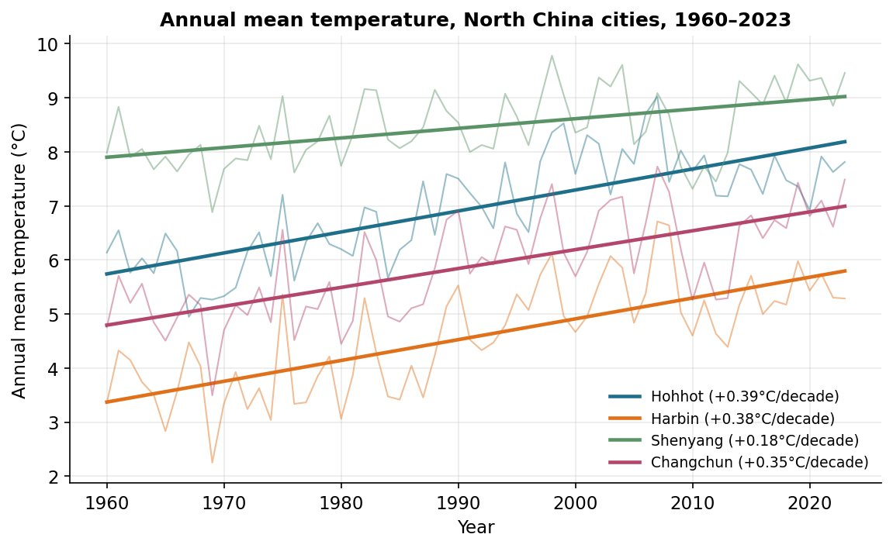
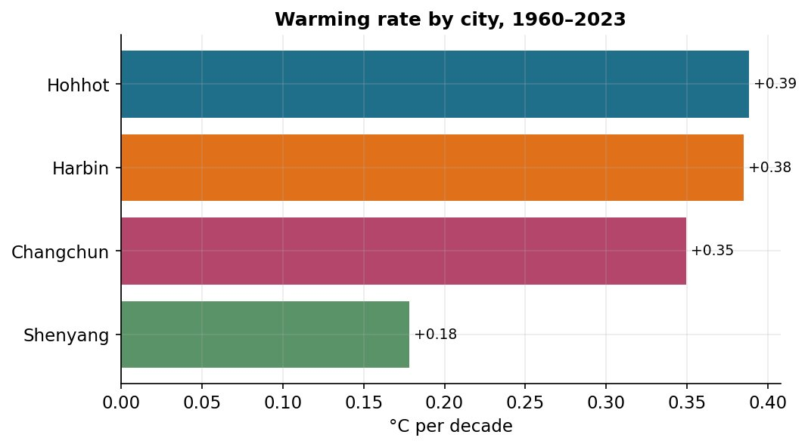
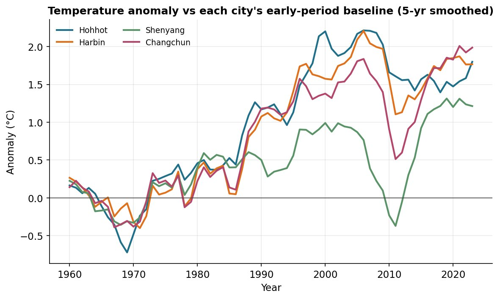

# How Fast Are Northern China's Cities Warming?

### Annual mean temperature trends in four northern Chinese cities, 1960–2023

**AAE 718 — Project 03 (Climate Data), Summer 2026**

## 1. Motivation

Northern China, the Northeast and the Inner Mongolian plateau, has some of the coldest, most continental winters in the country, and it is exactly the kind of place where global warming is expected to show up most strongly: high-latitude, far from the moderating influence of the ocean, and undergoing rapid urban growth. This project asks a simple, personal question about that region: over the past six decades, how much have its cities actually warmed, and do they all warm at the same pace?

I look at four cities spanning the region — Hohhot (Inner Mongolia), Harbin (Heilongjiang), Changchun (Jilin), and Shenyang (Liaoning) — using long, daily station records. Comparing several cities at once separates a genuine regional signal from any single city's quirks, and lets us see whether the most industrialized city behaves differently from the others.

## 2. Data and methods

The data are daily station observations from NOAA's Global Historical Climatology Network, retrieved through the NCEI Access Data Service. For each of the four stations I pulled daily maximum, minimum, and (where available) average temperature in metric units from 1960 through 2023. Each station returned a long, near-complete record: about 23,300 daily observations and 64 complete years per city.

For each day I use the reported daily mean temperature (TAVG); where TAVG is missing I fall back to the midpoint of the daily max and min, (TMAX + TMIN) / 2. I then average to an annual mean temperature for each city and year, keeping only years with at least 330 valid days so that incomplete years cannot distort the average. Trends are ordinary least-squares fits of annual mean temperature against year, reported in °C per decade.

Two limitations should be kept in mind. First, these are city/airport stations, so part of any warming trend reflects local urbanization (the urban heat island) on top of regional climate change — and northern Chinese cities grew enormously between 1960 and 2023. Second, four stations cannot represent all of northern China; they are illustrative of the region's larger cities, not a complete picture.

## 3. Results

### 3.1 Every city has warmed substantially

*Figure 1. Annual mean temperature for each city (thin lines) with OLS trend lines (thick); warming rates in the legend.*

Figure 1 shows the central result: all four cities warmed over 1960–2023, and every trend line slopes clearly upward. The cities keep their rank order throughout. Shenyang is consistently the warmest and Harbin the coldest, with Hohhot and Changchun in between, but each city's whole series drifts upward by roughly 1–2.5 °C across the record. Year-to-year scatter is large, yet over 64 years the upward slope is unambiguous.

### 3.2 The warming rate is fast — and uneven

*Figure 2. Warming rate by city, °C per decade.*

Figure 2 ranks the warming rates. Three of the four cities cluster tightly and high — **Hohhot +0.39, Harbin +0.38, Changchun +0.35 °C per decade** — averaging about +0.33 °C/decade across all four, or roughly 2.1 °C of warming over the full 64-year period. For context, that pace is well above the global mean-surface warming rate for the same era, consistent with the expectation that high-latitude, continental interiors warm faster than the global average.

The clear outlier is **Shenyang at +0.18 °C/decade**, less than half the rate of the others. This is the most interesting feature of the analysis, because Shenyang is the largest and most heavily industrialized of the four — it served as the historic heart of China's Liaoning steel-and-heavy-industry belt. A plausible explanation is aerosol "dimming": dense industrial air pollution reflects sunlight and can locally suppress warming, partially masking the greenhouse signal that the cleaner-aired cities show in full. Station siting or urbanization differences could also contribute. The data cannot settle the cause, but they clearly flag Shenyang as behaving differently from its neighbours.

### 3.3 The warming is recent and not steady

*Figure 3. Temperature anomaly relative to each city's 1960–1979 baseline, 5-year smoothed.*

Plotting each city as an anomaly against its own early-period (1960–1979) baseline puts the cities on a common scale (Figure 3) and reveals the shape of the warming. From 1960 to the mid-1980s the anomalies hover near zero — there is little warming in the first quarter-century. The temperature then climbs steeply from the late 1980s through the 2000s, the period of China's most rapid industrialization and urban expansion, with the three fast-warming cities reaching +1.5 to +2.2 °C above their baselines. Shenyang again stands apart: it rises far less, and even dips sharply around 2010–2012 before recovering. The synchronized timing across cities — flat, then a sharp common upturn around 1990 — points to a genuine regional and global climate signal rather than isolated local noise.

## 4. Conclusion

Across four northern Chinese cities, the answer to the opening question is clear and consistent: these cities have warmed markedly over 1960–2023, by about **+0.33 °C per decade on average (~2.1 °C total)** — faster than the global mean — and most of that warming has arrived since the late 1980s. But the pace is not uniform: Hohhot, Harbin, and Changchun warmed at nearly twice the rate of heavily industrial Shenyang, whose suppressed and interrupted trend is consistent with aerosol dimming masking part of the greenhouse warming. The natural next step would be to bring in daily maximum-versus-minimum trends (warming is often concentrated in nighttime lows) and a measure of local aerosol or urban growth, to separate how much of each city's trend is global climate change and how much is the city itself heating up around the thermometer.

---

*Code, data, and figures are in the project GitHub repository: add your repo URL here. Data: NOAA GHCN-Daily via the NCEI Access Data Service.*
